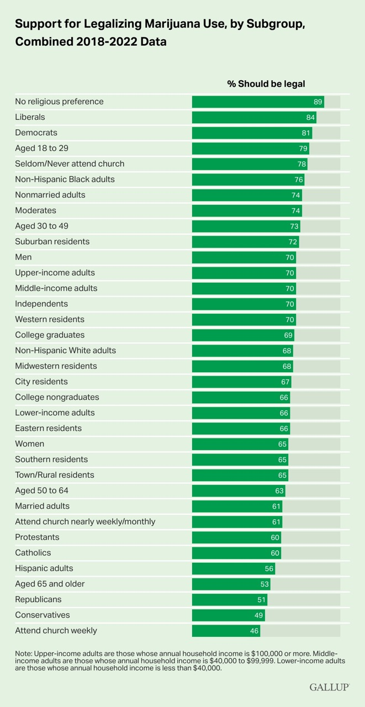

Dle průzkumu společnosti Gallup je podpora legalizace marihuany v USA na rekorní úrovni 68 %. Jedná se o dlouhodobý průzkum, který se realizuje již od roku 1969. Tehdy bylo o legalizaci přesvědčeno pouze 12 % Američanů, od té doby ale podpora stabilně roste. Na přelomu tisíciletí dosáhla podpora již 31 % a 50% hranici překonala v roce 2013.

 
<html>

<body>

</body>
</html>

 
A jaká je podpora mezi jednotlivými skupinami ve společnosti? Obecně se dá říci, že nejvíce jsou pro legalizaci osoby bez náboženského vyznání, liberálové a mladí mezi 18-29 lety. Na opačné straně (ne)podpory se nachází konzervativci, občané starší 65 let, či osoby se silným náboženským vyznáním, kteří víru praktikují aktivně a dochází do kostela každý týden.
 

Celkové výsledky za jednotlivé skupiny viz graf níže:

  

 

Ideologie, náboženství a věk tak hrají nejvýznamější roli při formulování názoru na legalizaci marihuany. Statistický model rovněž indikuje, že ideologie je o něco více vlivná, než další faktory. Zároveň není příliš podstatné, jaké urovně vzdělání člověk dosáhl, ani z jakého regionu pochází. Mezi těmito faktory jsou sice statistické rozdíly, ale ne významné.
 

Závěrem je dobré zmínit, že podpora legalizace marihuany u Američanů výrazně rostla poslední 2 dekády, poslední 3 roky ovšem podpora zůstává na stabilní a rekorní úrovni 68 % a k žádným změnám nedochází. Že by podpora narazila na svůj strop? Nejspíše tomu tak nebude, dle dat totiž  mezi mladými konzervativci podpora legalizace roste, v příštích dekádách tak může dojít k dalšímu zvýšení podpory, až bude současná generace nahrazovat populaci starší.
 

 

<b>References:</b>

<a href="https://news.gallup.com/poll/405086/marijuana-views-linked-ideology-religiosity-age.aspx">https://news.gallup.com/poll/405086/marijuana-views-linked-ideology-religiosity-age.aspx</a>

 

<b>Do you want to read more articles like this? Then by me a coffee!</b> 

 
